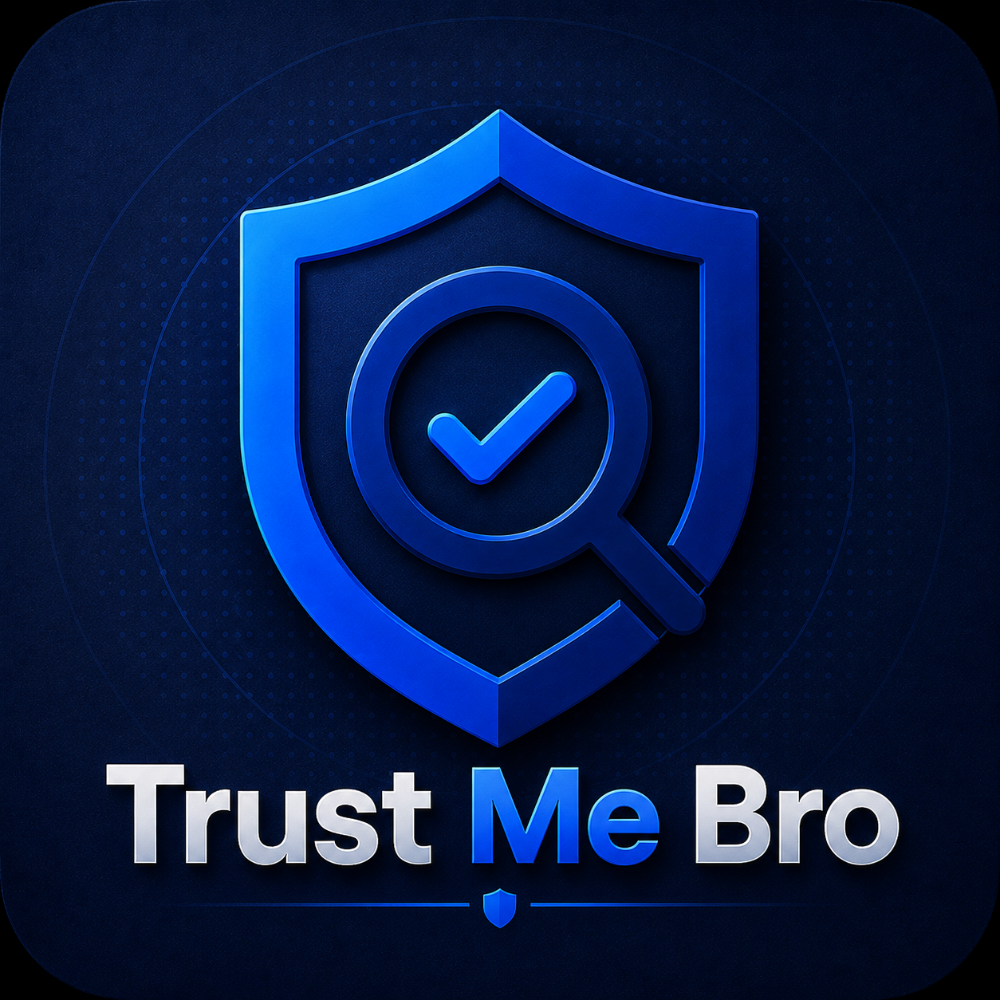
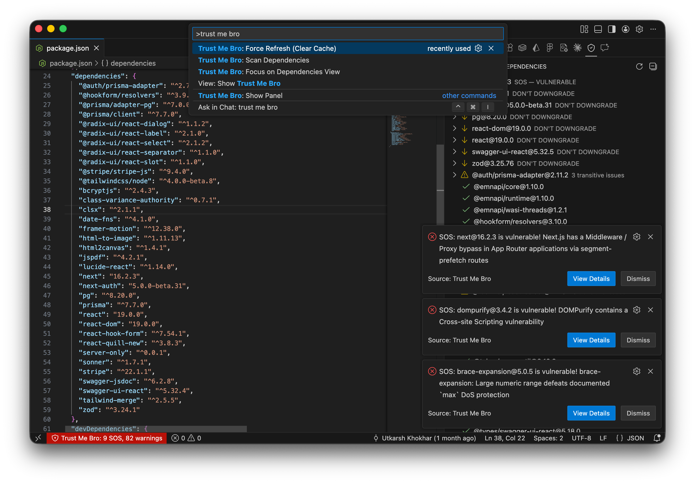

  

  <strong>Dependency trust intelligence for modern developers.</strong>

  
  

---

Trust Me Bro is a VS Code extension that continuously monitors your project's dependencies for compromises, vulnerabilities, and supply chain risks — directly inside your editor.

No manual scans. No dashboards. Just ambient trust awareness while you code.

## Features

- **Continuous Monitoring** — Watches your lockfile for changes and periodically checks advisory databases for new threats against your installed packages.
- **Directional Safety Alerts** — Tells you exactly what action to take:
  - **SOS Alert** — Your installed version is compromised. Act now.
  - **Don't Upgrade** — You're safe, but a newer version is compromised.
  - **Don't Downgrade** — You're safe, but an older version is compromised.
- **Transitive Dependency Awareness** — Traces risky packages back through the dependency tree so you know which direct dependency introduced the risk.
- **Multi-Lockfile Support** — Works with `package-lock.json`, `yarn.lock`, and `pnpm-lock.yaml`.
- **Multi-Root Workspaces** — Monitors each workspace root independently.
- **Offline Resilient** — Caches advisory data locally. Works offline with stale-but-visible trust state.

## How It Works

Trust Me Bro checks your resolved dependencies against [OSV.dev](https://osv.dev/) and the [GitHub Advisory Database](https://github.com/advisories) to determine the trust state of every package in your project.

Alerts are surfaced through:
- **Status Bar** — Always-visible trust summary.
- **Sidebar Panel** — Detailed dependency tree with trust states.
- **Toast Notifications** — Only for critical SOS alerts when an installed version is actively compromised.

## Getting Started

1. Install the extension from the [VS Code Marketplace](https://marketplace.visualstudio.com/items?itemName=uskhokhar.trust-me-bro).
2. Open a project with a lockfile.
3. Trust Me Bro activates automatically and begins monitoring.

## Configuration

| Setting | Default | Description |
|---------|---------|-------------|
| `trustMeBro.pollInterval` | `30` | Advisory check interval in minutes |

## Contributing

Contributions welcome! See [CONTRIBUTING.md](CONTRIBUTING.md) for setup and guidelines.

## License

[MIT](LICENSE)
